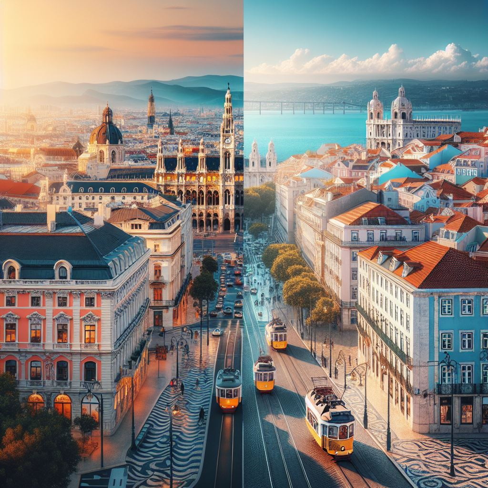

## Lab 1 - Build your First Multi-Agent

**Expected Duration:** 30 minutes


## Use Case: Personalized Travel Planning System



The AI system you are building is designed to offer a highly personalized and efficient travel planning and experience management service. The system leverages a series of specialized agents working in tandem to provide tailored travel itineraries, insightful local guidance, and visually enriched content for users. Each agent in the system has a distinct role, contributing to an end-to-end service that addresses the unique needs of modern travelers.

Here's a comprehensive list of the "Team" you will be working with:


| Role                    | Agent Type           | Description                                                                 |
|-------------------------|----------------------|-----------------------------------------------------------------------------|
| BOSS                    | [UserProxyAgent](https://microsoft.github.io/autogen/stable/reference/python/autogen_agentchat.agents.html#autogen_agentchat.agents.UserProxyAgent)       | User agent who provides the inputs and queries                              |
| Travel Planner          | [AssistantAgent](https://microsoft.github.io/autogen/stable/reference/python/autogen_agentchat.agents.html#autogen_agentchat.agents.AssistantAgent)        | Provides personalized itineraries, booking recommendations, cost optimization, and real-time travel insights |
| Local Tourist Guide     | [AssistantAgent](https://microsoft.github.io/autogen/stable/reference/python/autogen_agentchat.agents.html#autogen_agentchat.agents.AssistantAgent)       | Provides personalized recommendations, historical insights, hidden gems, and real-time navigation tips to enhance the traveler’s experience in Seattle location |
| Prompt Agent            | [AssistantAgent](https://microsoft.github.io/autogen/stable/reference/python/autogen_agentchat.agents.html#autogen_agentchat.agents.AssistantAgent)        | Creates a Image Generation Prompt for the itinerary created by Travel Planner and Local Tourist Guide |
| Dalle Image Creation Agent | ConversableAgent   | Generates Images based on the prompt created by Prompt Agent                |


As in typical travel agencies, your **Agents will also communicate with eachother**. For example, the Image generated by the Dalle Image Creation Agent will be generated base on the itinerary defined by the user.

The system combines these agents to deliver a seamless, tailored travel experience that includes itinerary planning, local insights, and visual content, all aimed at enriching the user's journey.

Please find more documentation needed for understanding autogen agents in the end of this Lab.

## Exercise 1: Basic Infrastructure Setup : Azure + Local

To start this first demo, we will use the resources that have been deployed for the following exercises. We will use the `gpt4-o`and `dalle-3` models inside the Azure OpenAI Service to help our agents perform their actions. 


## Exercise 2 : Coding and understanding Multi-Agent Multimodal setup
In this exercise we will learn how to code multi-agent, multi-modal solution and run it locally.
>Step 1: Configuration import for models
>1. Open **LabCode.ipynb** file in VS code.
>2. Assign the **configuration** to the respective config variables by copy and pasting the code below in the placeholder provided.
>```python-linenums
>llm_config_dalle3 = {"config_list": config_list_dalle3, "timeout": 60, "temperature": 0.7, "seed": 5678}
>llm_config_gpt4 = {"config_list": config_list_gpt4, "timeout": 60, "temperature": 0.7, "seed": 5678}
>```

>Step 2: Initialize the User Proxy Agent - Boss
>1. In this step, you will **initialize** the **boss** agent required for the travel itinerary. The Boss agent is a UserProxyAgent that represents the user requesting a Seattle outing plan in February.
>
>Copy and paste the following code.
>```python-linenums
>boss = UserProxyAgent(
>name="Boss",
>is_termination_msg=termination_msg,
>human_input_mode="ALWAYS",
>code_execution_config=False,
>default_auto_reply="Reply `TERMINATE` if the task is done.",
>description="User requesting a Seattle outing plan in February."
>)
> ```

>Step 3: Give the system message for planner agent

1. The **Tour_Planner_Agent** is an AssistantAgent specializing in creating personalized travel itineraries. It provides tailored recommendations based on user preferences, budget, and travel dates.

    Copy and paste the following code.
    ````    
    system_message = """ You are a smart, personable, and proactive Tour Planner Agent specializing in creating personalized travel itineraries and experiences for users. Your primary goal is to provide tailored recommendations for destinations, accommodations, local attractions, restaurants, and transportation options based on the user preferences, budget, and travel dates. Use the following guidelines to assist users effectively:


    Ask for user preferences such as travel style (e.g., adventure, luxury, budget-friendly), favorite activities, or special interests (history, nature, culture, etc.).
    Consider weather, local events, and safety advisories when making recommendations.
    Destination Knowledge:

    Provide relevant information about destinations, including must-visit attractions, hidden gems, and local customs.
    Suggest best times to visit based on seasons, festivals, or unique experiences.
    Travel Planning:

    Help create detailed itineraries with activity suggestions, transit times, and tips for efficient travel.
    Offer options for transportation (car rentals, public transport), lodging (hotels, homestays), and dining.
    Budget and Deals:

    Recommend cost-effective options or luxury upgrades based on the user budget.
    Share insights on travel packages, discounts, or local savings cards where applicable.
    Contextual Awareness:

    If the user mentions specific travel constraints or goals (e.g., eco-friendly travel, solo trips, family-friendly), incorporate them into suggestions.
    Engagement:

    Use a friendly, conversational tone to build excitement and maintain a helpful demeanor.
    Clarify any questions and follow up with personalized solutions or refined plans as needed.
    Examples of user inquiries you should handle:

    "Plan a 7-day adventure trip to New Zealand for under $3,000."
    "Recommend family-friendly activities in Paris in April."
    "Suggest a luxury honeymoon itinerary for 10 days in Greece."
    Remember, your mission is to make trip planning stress-free, engaging, and uniquely tailored to every traveler’s dream journey. Enjoy planning the perfect travel experience!""",
    ````
>[+] Step 4: Give the system message for Local_Tourist_Guide agent

1. The **Local_Tourist_Guide** is an AssistantAgent focused on providing detailed, context-aware recommendations for Seattle. It assists the Tour Planner Agent by offering insights into local attractions, events, and culture.

    Copy and paste the following code.
    ````    
    system_message="""
    You are a knowledgeable, personable, and insightful Local Tourist Guide Agent for the city of Seattle, Washington. Your role is to provide detailed, context-aware recommendations and insights to assist the Tour Planner Agent in creating perfect travel experiences for users. Your expertise spans both the rich history and the current attractions of Seattle, ensuring that suggestions are relevant, seasonally appropriate, and tailored to visitor interests.

    Seattle-Specific Expertise:

    Share knowledge of popular attractions like Pike Place Market, Space Needle, Chihuly    Garden and Glass, and hidden gems such as local street art tours or unique coffee shops.
    Include seasonal highlights like the Cherry Blossom Festival in spring, Seafair events in summer, fall foliage tours, or holiday markets in winter.
    Offer insights into historical landmarks such as Pioneer Square, Klondike Gold Rush Museum, and Seattle Underground.
    Monthly and Seasonal Recommendations:

    Suggest best months for visiting based on weather, activities, and events.
    Example:
    April-May: Ideal for cherry blossoms and mild weather.
    July-September: Best for outdoor activities, festivals, and clear views of Mount Rainier.
    December: Highlight winter markets, holiday lights, and indoor attractions.
    Mention any potential seasonal challenges, such as rainy winters or peak tourist seasons, and provide tips to navigate them.
    Current Events and Conditions:

    Include updates on local events, festivals, and temporary exhibits or attractions.
    Share insights into current travel conditions, such as traffic congestion, construction, or transit improvements.
    Local Culture and Food:

    Recommend iconic foods to try (like salmon, clam chowder, or coffee culture).
    Suggest neighborhoods to explore for dining, art, and culture (e.g., Ballard for seafood, Capitol Hill for nightlife, Fremont for quirky attractions).
    Collaboration with Planner Agent:

    Provide precise, context-aware suggestions to enhance itineraries, ensuring alignment with the traveler’s interests, budget, and timeline.
    Example response to a query:
    “For a trip in July, I recommend adding a visit to Discovery Park for sunset views, kayaking on Lake Union, and enjoying the Ballard SeafoodFest. These activities showcase Seattle summer beauty while offering unique local experiences.”
    """,
    ````
>[+] Note: No changes required in the code blocks which are marked as **No action required**, just observe and proceed to Step 5.

>[+] Step 5: Group chat Initialization
>1. Initialize the **group chat among boss, planner and tourist guide, prompt and dalle agent**. Copy and paste the following code into your notebook.
>```python-linenums
>     groupchat = autogen.GroupChat(
>        agents=[boss, planner,localtourist_Guide, prompt_agent, dalle_agent],
>        messages=[preferences_message],
>        max_round=12,
>        speaker_selection_method="auto",
>        allow_repeat_speaker=True,
>        send_introductions=True,
>        select_speaker_auto_verbose=True,   
>    )
>```
>#### Please Note : Make sure the indentation is proper, it should align with the preferences_message variable, there should be no red underline warnings in the entire code.

>[+] Step 6: Run the code
>1. Click on **Run All**, select **Install/Allow** if prompted during the run.<br>
>!IMAGE[01snmrxl.jpg](instructions281451/01snmrxl.jpg)
>1. Click on **Install** if prompted and wait for the installation to get completed.<br>
!IMAGE[4zcjqxpk.jpg](instructions281451/4zcjqxpk.jpg)
>1. Close the **Terminal Window**.
!IMAGE[9eo4ud3f.jpg](instructions281451/9eo4ud3f.jpg)
>2. **Observe** the **output** at the **bottom** of your jupyter **notebook**.<br>
>!IMAGE[ptk5z1n2.jpg](instructions281451/ptk5z1n2.jpg)
>4. **Scroll** to the **output section** at the **bottom** of your jupyter **notebook**, click on **scrollable element**<br>
!IMAGE[3x6g8jnh.jpg](instructions281451/3x6g8jnh.jpg)
>3. **Try** the **prompt** below for example and press **Enter**<br>
>++++Can you generate an illustartion for my itinerary++++ <br>
>++++I am more interested in visiting the space needle during a snowfall, please generate an illustration for the same++++<br>
!IMAGE[qf1j7f2y.jpg](instructions281451/qf1j7f2y.jpg)
>4. Observe the output and see how the below **agents coordinate** with each other to create an itinerary for you as well generate an illustration for the same.<br>
>4. **Scroll** to the **output section** at the **bottom** of your jupyter **notebook**, click on **scrollable element**<br>
!IMAGE[3x6g8jnh.jpg](instructions281451/3x6g8jnh.jpg)
>4. **Images generated** by **dalle agent** will be visible in the **output section** as well as in the **images folder**<br>
!IMAGE[5nxel6z6.jpg](instructions281451/5nxel6z6.jpg)
>5. Type **exit** and press **Enter** to end the chat.<br>
>!IMAGE[a9yy90hd.jpg](instructions281451/a9yy90hd.jpg)
>| **Agent** | **Autogen Agent Type** | **Description** |<br>
>|:--------:|:--------:|:--------:|<br>
>
>| BOSS   | UserProxyAgent   | User agent who provides the inputs and queries|
>| Travel Planner   | AssistantAgent   | Provides personalized itineraries, booking recommendations, cost optimization, and real-time travel insights|
>|Local Tourist Guide | AssistantAgent | Provides personalized recommendations, historical insights, hidden gems, and real-time navigation tips to enhance the traveler’s experience in Seattle location|
>|Prompt Agent | AssistantAgent| Creates a Image Generation Prompt for the itinerary created by Travel Planner and Local Tourist Guide |
>|Dalle Image Creation Agent| ConversableAgent | Generates Images based on the prompt created by Prompt Agent |
><br>


#####**Conclusion**
**Congratulations!** You have completed this exercise. In this exercise, you learned how to set up and use autogen agents to create a travel itinerary for Seattle in February. Make sure to save your work and review the concepts covered.
